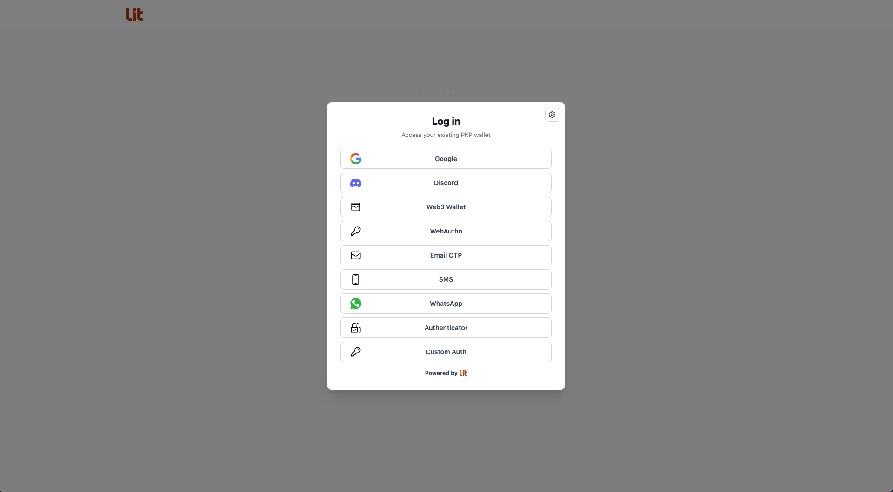
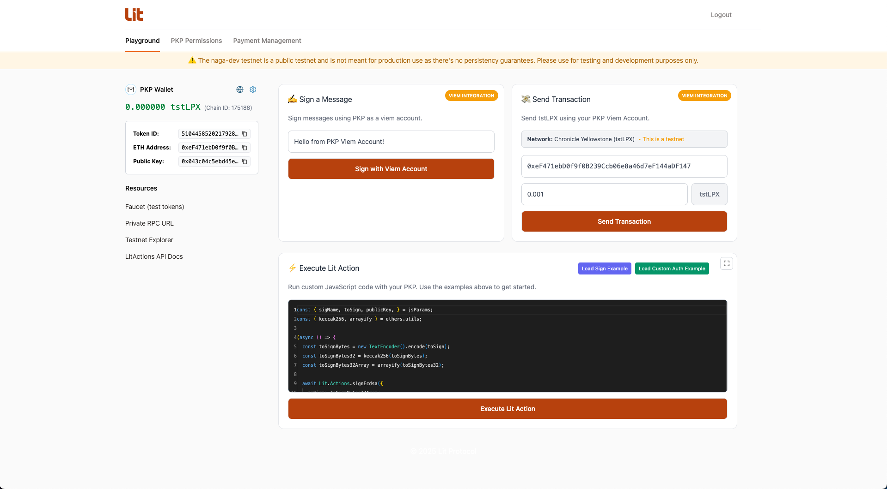

# Lit Explorer Naga

Lit Explorer Naga is an application that allows you to authenticate with Lit Protocol using the native Lit auth methods.

# Env vars

```bash
# Global Settings
VITE_LOGIN_SERVICE_URL=https://login.litgateway.com
VITE_LOGIN_DISCORD_CLIENT_ID=1052874239658692668

# Network-Specific Auth Service URLs
VITE_AUTH_SERVICE_URL_NAGA_DEV=https://naga-dev-auth-service.getlit.dev
VITE_AUTH_SERVICE_URL_NAGA_TEST=https://naga-test-auth-service.getlit.dev
VITE_AUTH_SERVICE_URL_NAGA=https://naga-auth-service.getlit.dev
```

## Getting started

```
pnpm install
pnpm nx run explorer:dev
```

## Docker

To produce a deployable container:

```
pnpm nx run explorer:build
pnpm nx run explorer:docker-build
docker run -p 4173:80 explorer
```

The image serves the built assets via Nginx and includes SPA routing so client-side navigation works.

## Adding Lit Action examples

- Add a new file in `src/lit-action-examples/entries/` that default-exports a `LitActionExample`. The `id` must be unique.
- Use `String.raw` to define multiline snippets, e.g. ``const code = String.raw\`...\`;`` and fill in `title`, optional `description`, `order`, and any default `jsParams`.
- The registry auto-loads every file in that directory, so your example will appear in the Lit Action editor once you save and refresh the app.
- Prefer small, focused samples that demonstrate a single concept; link to docs inside the description if extra context is needed.

## FAQs

### What "logged-in" means here

- You are considered "logged-in" when both a PKP and an auth context exist in state.

### How you become "logged-in"

After authenticating with a method (Google, Discord, WebAuthn, EOA, Stytch, Custom), either:

- You select an existing PKP in the PKP selection section
- You mint a new PKP and immediately create `authContext`, then set `user`

### What redirect happens and when

The `<LitAuthProvider />` does not redirect on successful login. It simply closes the modal once user is set and isAuthenticated becomes true.

The dashboard is always the index route for `/`, and it conditionally renders based on auth state from context. When the user logs in, React re-renders the same component with different UI.

Inside `LoggedInDashboard`, it reads user from `useLitAuth()`. If there’s no user, it shows a sign-in experience and, in popup mode, auto-opens the modal.

# Screenshots

## Login Modal



## Logged in Dashboard

